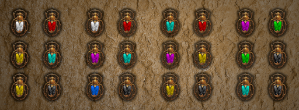
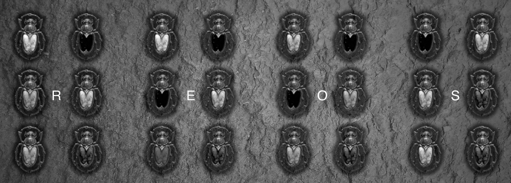
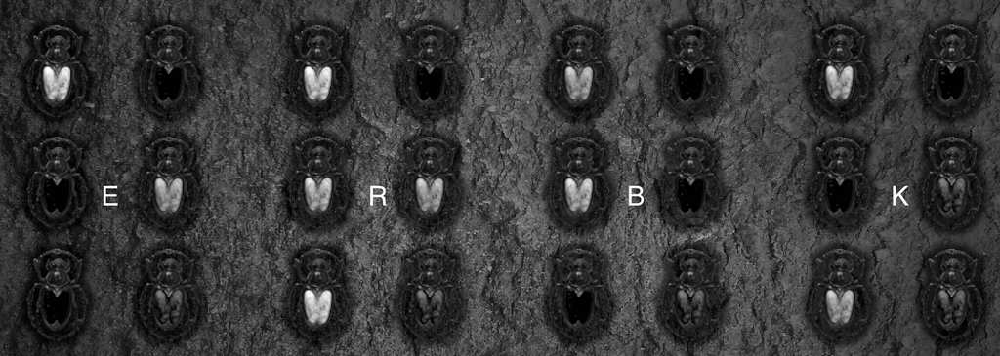

# Blue Gold Puzzle Writeup

## Puzzle Info

The puzzle provided the text: _"Blue Gold beneath Hamunaptra? Or perhaps something else?"_ and an image of 24 colored beetles.

## Solution

Our first thought here was there are 12 pairs of horizontally-adjacent scarabs, each representing a character combination, set out in a 4x3 grid. The key to validate this idea would be to find some formula for combining colors into a letter. Assuming this method was correct, we figured the order of the pairs would have to read top to bottom, then left to right, since the most top left pair was (White \+ Red), then the next pair to the right of that was also (White \+ Red). It seemed unlikely that the same letter would be next to each other at the start of a word.

To find the correct equation to convert colors into words, we tried converting primary colors into bit math. A simplified version of hex color codes: red would be (100), green would be (010), and so on for compound colors. White and black would either be all or no colors \- (111) or (000) \- depending on what we tried.

We tried several bitwise operations \- i.e addition, xor, and, or, shifts \- with the pairs to see if we came up with something sensible that represented letters or ascii characters. In order to convert numbers to ascii, we used the standard alphachar ascii values \- i.e "65" equals a capital "A"- as well as 0 and 1-indexed values in the english alphabet \- i.e "1" or "0" being "A". This approach didn’t lead us anywhere.

Overnight, one of our team members was having trouble sleeping too deep in thought about Goldbug… (note: this is a side-effect of puzzle solving). The hypothesis he dreamt up was that there was something to do with color addition or subtraction. In color theory, there is the RGB (red, green, blue) additive model, typically used for computer screens, and the CMYK (cyan, magenta, yellow, black) subtractive model, typically used for printing. Given that all the colors in the scarabs were in either one of the color combinations, we figured this was the right path.

Another team member had a recognition that if we’re going to be doing a trio of color additions or subtractions, then it’s highly likely the resulting scarabs are braille representation → 4 pairs of braille, 3 color combinations. That left us with the question: what means a filled in dot, and what means an empty dot. We assumed by default black scarabs meant empty dot and white dots meant filled in dot due to the consistent bottom right placement of the black dot, a frequently empty dot in braille alpha chars.

We tried several combinations of color addition/subtraction, but most of the time, our reasoning left us with some invalid character that was not an alphabetic character. Finally, we came up with the right color subtraction (a decomposition of RGB) using GIMP where all the braille characters were valid:

Clear white dots were filled in, black/dark grey were empty. The red layer was PFTA, green layer, REOS, and blue layer ERBK. If you order them first by RGB layer, left to right, you get the correct answer:

<result>PreferToBask</result>
