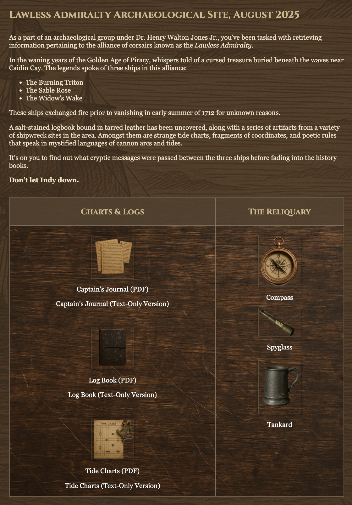
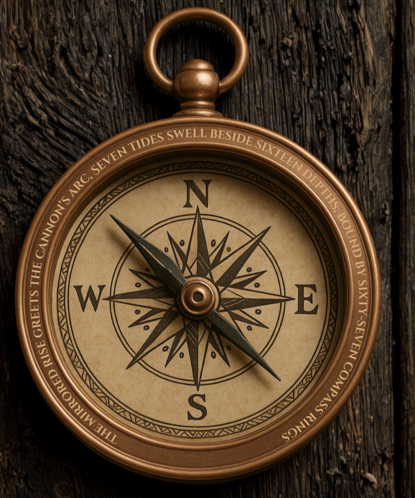
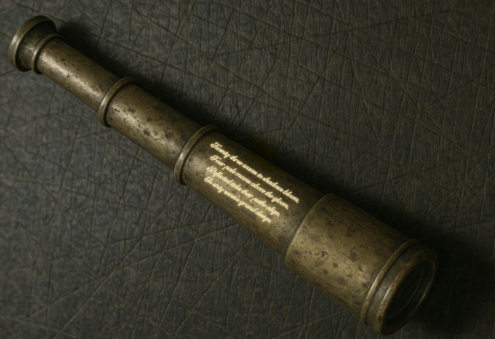
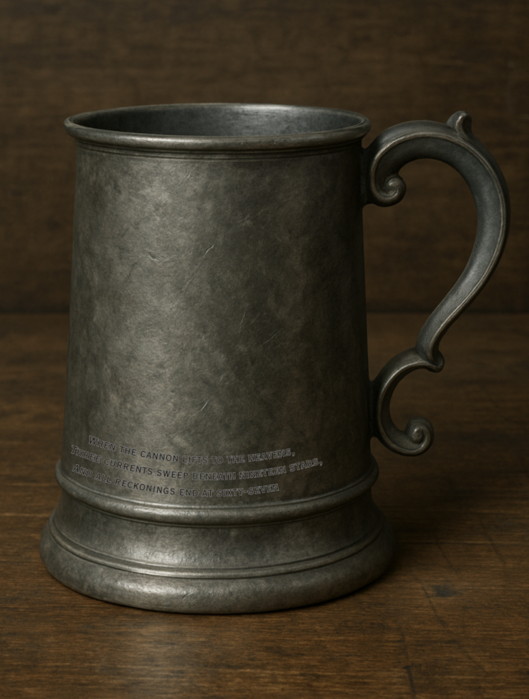
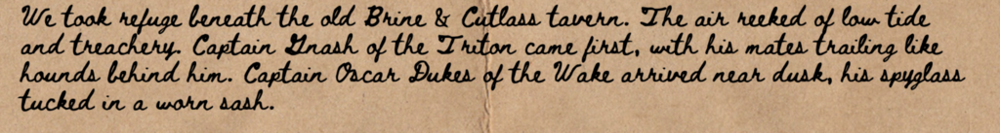
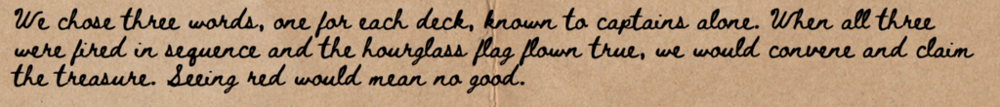
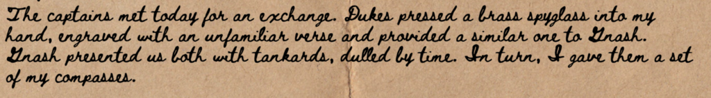
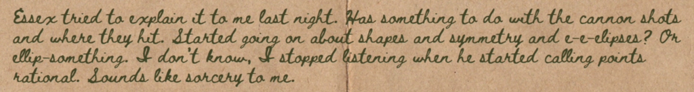
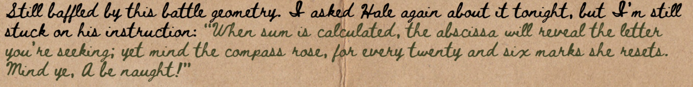

# Curves of the Cursed Cay Puzzle Writeup

## Puzzle Info

This puzzle came with a lot of different components:

- Three Artifacts with messages

|        Compass        |       Spyglass        |        Tankard        |
| :-------------------: | :-------------------: | :-------------------: |
|  |  |  |

- A Journal from Captain Elman Royal (Sable Rose)
- A Log book from Widow's Wake
- Tidecharts of the Outer Shoals

## Solution

We were pretty on the money with this puzzle and had the right intuition the first time around. We first read through The Journal which gave us a ton of useful information. First, we were quickly introduced to the three pirate captains and their crews from the title of the journal and the opening entry:

- Captain Oscar Dukes of the Wake
- Captain Elman Royal of The Sable Rose
- Captain Gnash of the Triton

The Journal also hinted that the answer would consist of three words, one tied to each captain:

> "We chose three words, one for each deck, known to captains alone. When all three were fired in sequence and the hourglass flag flew true, we would convene and claim the treasure"

From this we assumed that the three crews' words, in sequence, would form the final answer.

The next major clue came in the subsequent journal entry which linked each captain to one of the three artifacts:

> "Dukes pressed a brass spyglass into my hand… Gnash presented us both with tankards… I gave them a set of my compasses"

So the mapping was:

- Captain Oscar Dukes of the Wake → Spyglass
- Captain Elman Royal of The Sable Rose → Compass
- Captain Gnash of the Triton → Tankard

The Journal also included some peculiar notes from Essex Hale written in green that clued us into the mathematical formula needed to solve this puzzle:

> "Started going on about shapes and symmetry and e-e-elipses? Or ellip-something. I don't know, I stopped listening when he started calling points rational. Sounds like sorcery to me."

Our first thought was some sort of elliptic curve cryptography but rational points on elliptic curves…

> "When sum is calculated, the abscissa will reveal the letter you're seeking; yet mind the compass rose, for every twenty and six marks she resets. Mind ye, A be naught!" This quote appeared in green text in the original document." — Essex Hale

Here "abscissa," another word for x-coordinate, gave us the procedure: perform elliptic curve addition, then take the resulting x-coordinate modulo 26 to map to a letter (A = 0, B = 1, …, Z = 25).

Equipped with this information, opening the Log Book and Tide Charts made the path forward clearer. We noticed that the symbols in the Log Book corresponded with coordinates on the Tide Chart. Taking the hint about ellipses and rational points from earlier, we knew we had to add the coordinates using elliptic curve addition. All that was missing was the actual equation for each curve.

Using a curve-fitting method (and a little help from ChatGPT), we took the coordinates for each pirate crew and generated elliptic curves that passed through their sets of points. Incredibly, the resulting equations aligned exactly with the numbers engraved on the captains' artifacts which made us confident we were on the right path:

- **Captain Dukes' Spyglass (Wake):** Twenty-three waves in shadows bloom, four pale moons above the gloom, reflected tides their paths align, in sixty-seven's grand design → y² = x³ + 23x + 4 (mod 67)
- **Captain Royal's Compass (Sable Rose):** The mirrored rise greets the canon's arc, seven tides swell besides sixteen depth, bound by sixty-seven compass rings → y² = x³ + 7x + 16 (mod 67)
- **Captain Gnash's Tankard (Triton):** When the cannon lifts to the heavens, three currents sweep beneath nineteen stars, and all reckonings end at sixty-seven → y² = x³ + 3x + 19 (mod 67)

With all the pieces in hand, the last step was to actually perform the additions described in the Log Book with the proper equations. Each symbol corresponded to a coordinate, and adding them together on the appropriate crew's elliptic curve produced a new point. As Essex Hale's green text hinted, the x-coordinate (the abscissa) of each sum, reduced modulo 26, mapped neatly to a letter of the alphabet (A = 0, B = 1, …, Z = 25).

Following the Log Book night by night, we uncovered the words chosen by each crew:

**Night 1 (June 3rd):**

- **The Sable Rose:** SET
  - Compass (0, 4) + Skull (23, 4) = (44, 63) → S
  - Compass (0,4) + Moon (17, 31) = (56, 45) → E
  - Compass (0, 4) + Crown (6, 41) = (19, 24) → T
- **The Triton:** FOUL
  - Shield (0, 32) + Cannon (5, 62) = (31, 50) → F
  - Shield (0, 32) + Diamond (34, 37) = (66, 45) → O
  - Shield (0, 32) + Wheel (16, 3) = (20, 21) → U
  - Shield (0, 32) + Key (2, 57) = (37, 8) → L
- **The Wake:** SET
  - Hook (0, 2) + Sun (17, 22) = (18, 32) → S
  - Hook (0, 2)+ Eye (11, 28) = (4, 19) → E
  - Hook (0, 2) + Anchor (3,10) = (19, 59) → T

**Night 2 (June 6th):**

- **The Sable Rose:** GET
  - Compass (0,4) + Skull (4,23) = (6, 1) → G
  - Compass (0,4) + Moon (17, 31) = (56, 45) → E
  - Compass (0,4) + Crown (6, 41) = (19, 24) → T
- **The Triton:** RAT
  - Shield (0, 32) + Dove (33, 64) = (43, 40) → R
  - Shield (0, 32) + Dagger (1, 31) = (0, 35) → A
  - Shield (0, 32) + Hand (15, 42) = (45, 5) → T
- **The Wake:** (There was no addition in the log book)

**Night 3 (June 7th):**

- **The Sable Rose:** MARK
  - Compass (0, 4) + Sun (12, 35) = (64, 54) → M
  - Compass (0, 4) + Serpent (6, 26) = (0, 63) → A
  - Compass (0,4) + Hand (19, 24) = (17, 31) → R
  - Compass (0, 4) + Crossbones (3, 8) = (36, 15) → K
- **The Triton:** THE
  - Shield (0, 32) + Trident (15, 42) = (45, 5) → T
  - Shield (0, 32) + Crown (5, 5) = ( 59, 32) → H
  - Shield (0, 32) + Skull (8, 35) = (56, 14) → E
- **The Wake:** SPOT
  - Hook (0,2) + Moon (17, 22) = (18, 32) → S
  - Hook (0,2) + Sword (6, 36) = (41, 56) → P
  - Hook (0,2) + Wheel (7, 21) = (66, 39) → O
  - Hook (0,2) + Fish (3, 10) = (19, 59) → T

The final answer was:

<solution>MARKTHESPOTS</solution>
