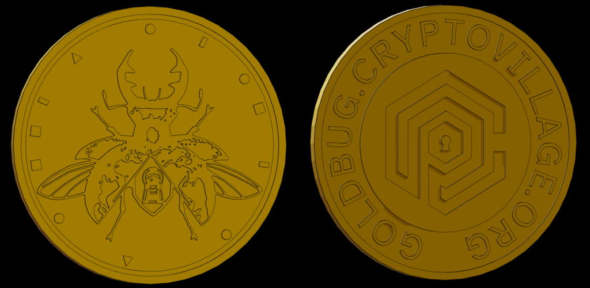

# I'll Flip You For It Puzzle Writeup

## Puzzle Info

> "For longer than I knew him, my father always carried this coin with him. He had long ago memorized every detail of the coin and was able to see every angle and shape in his mind as he felt it in his pocket. Knowing that it was always close by was somehow both a source of comfort and a force steadily driving him deeper into madness."

The puzzle starts with the above text and a link to a [3D rendering](https://gold-coin.t3.gg/) (created by Theo t3.gg) of a gold bug coin. These coins were also available at the Crypto & Privacy Village booth.

## Solution

From the text, "memorizing every detail of the coin and being able to see every angle and shape" we figured the answer had to do with the 12 shapes and their placement on the back of the coin. We tried wrapping the puzzle prompt text around the coin and hoping that the letters that aligned on the shape of the coins would line up with some text of letters. We also tried to figure out how the shapes are possibly linked to other circular devices: clocks and compasses. We tried to see if the angles of the shapes lined up with certain degrees or values of the clock, but none of these approaches seemed to indicate anything.

A hint came out that this puzzle was initially the first step to the META puzzle, but was then broken up into its own puzzle. Knowing this, we took a look at the META puzzle, and saw a clear place the coin would fit perfectly.

We placed the coin in the "coin" like feature and aligned it so the gold bug is facing upwards in the same orientation as the image. The angle of the shapes aligned on the following lines of letters (from out to in):

IES**W** - Circle  
YR**R**L - Rectangle  
ATP**O** - Circle  
**N**GTM - Square  
EL**G**S - Rect  
OLM**L** - circle  
C**E**PA - Triangle  
WRS**F** - circle  
**T**SUN - square  
**E**HRD - square  
AO**Y**C - Rect  
M**E**AA - Triangle

We figured the value of the shape must indicate some row from the letters, so we tried ordering by number of the sides of the polygon: most inner circle was circle, then either rectangle or square next, then triangle, then the most outer circle of letter square or rectangle. We tried both orderings of the square and rectangle, and the strategy that produced the winning combination was circle, rectangle, triangle, square. Above in the printout of letters each letter is bolded based on the shape, giving us the correct answer:

<result>WrongLeftEye</result>
