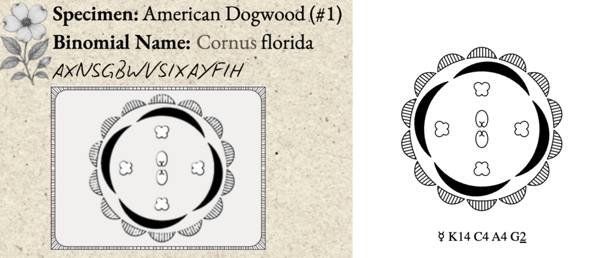
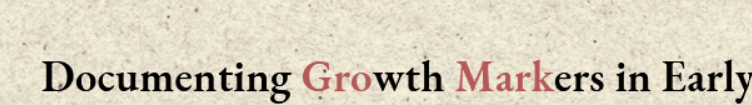

# Garden of Secrets Puzzle Writeup

## Puzzle Info

We were given a blurb on the main page about botanist John Bartram, who kept a ledger of 13 flowers. The ledger includes annotations, cipher texts, and binomial names for each flower. The pdf was titled National Treasure Garden of Secrets.

## Solution

The initial puzzle gave us a link to both the PDF of the ledger and a link to a [floral diagram website](https://kvetnidiagram.8u.cz/odiagramech_en.php). Our team spent some time getting familiar with the drawings to try and understand the complex ways of representing a flower (tepals, sepals, petals, stamens, carpels) with a formula. Using the floral diagram, which has a diagram generator, our team went through and made a floral representation of each of the 13 flowers present.

The resulting flower formulas looked like:

- K5 C5 A10 G5 Mayflower (Massachusetts)
- K14 C4 A4 G2 American Dogwood \#1 (Virginia/North Carolina)
- K5 C5 A10 G4 Mountain Laurel \#1 (Pennsylvania/Connecticut)
- K15 C5 A5 G3 Yellow Jessamine (South Carolina)
- K4 C4 A12 G2 Purple Lilac (New Hampshire)
- K10 C8 A8 G2 Black-eyed Susan (Maryland)
- K5 C5 A10 G1 Peach Blossom (Delaware)
- K5 C5 A5 G13 Violet \#1 (Rhode Island/New Jersey)
- K14 C4 A4 G2 Dogwood \#2 (Virginia/North Carolina)
- K5 C5 A10 G4 Mountain Laurel \#2 (Pennsylvania/Connecticut)
- K5 C5 A5 G13 Violet \#2 (Rhode Island/New Jersey)
- K5 C5 A10 G5 Cherokee Rose (Georgia)
- K5 C5 A10 G5 Rose (New York)

Our team also noted that each flower represented one of the 13 colonies, given an overview association with revolutionary figures and the formation of the US, and noted that above.

There initially was some confusion with the flower diagrams since using the flower generator, there are additional features such as the shape, rotation, etc. of the tepals, petals that aren’t accounted for in the formula, and likewise, in the PKCAG formula, a P could occasionally be switched with a K with no consequence. The puzzlemakers then suggested to us that it’s not important what the letter is in the formula, but rather only focus on the digits and their order.

We then consolidated all the digits and realized they were always 5 digits → K5 C5 A10 G5 becomes 55105\. With the cipher texts and the 5 digits, we tried to use the [https://www.dcode.fr/](https://www.dcode.fr/) website to see if we could get any useful results, but it was not helpful. Trying to decipher the secret messages with the Vigenere cipher seemed promising at first, seeing as how we got some readable words from decoded ciphers, but it ultimately was not the right move.

This was when we decided to ask the puzzlemakers for clarity. We wanted to make sure we were on the right track, and we were told to look closely at a quote on the blurb that mentions how, for Bartram, "family always came before anything else important.” Looking at taxonomic ranks, family comes before _genus,_ which was the final component we needed to solve the puzzle. In the next few hours, the organizers posted the following hint from the title of the ledger:

Looking at the highlighted letters, we did a search for “Gromark” to learn that it is a cipher that uses a keyword and a 5-digit primer to create a cipher. We realized that the keyword would be the genus of each flower, and the 5-digit primer would be the 5 digits we got from the floral diagrams. Using [this](https://thescytale.com/GR_GromarkDecoder.html%20) website to decode Gromark ciphers, we deciphered each ciphertext associated with the flowers by inputting their corresponding genus and 5-digit codes. For example, for Mayflower, the genus/keyword would be Erigaea. The floral diagram of Mayflower, which is K5 C5 A10 G5, would have 55105 as the 5-digit primer.

| Specimen             | Bonomial Name          | Ciphertext                       | Floral Diagram Digits | States | Plaintext                             |
| -------------------- | ---------------------- | -------------------------------- | --------------------- | ------ | ------------------------------------- |
| Mayflower            | Epigaea repens         | RAEDISWGLUBQVYLWTOE              | 55105                 | MA     | Overlook near terrace                 |
| American Dogwood \#1 | Cornus florida         | AXNSGBWVSIXAYFIH                 | 14442                 | VA/NC  | Arbor frames vault                    |
| Mountain Laurel \#1  | Kalmia latifolia       | GPVQTPFPJDGJIHDOPM               | 55104                 | PA/CT  | Hidden among laurels                  |
| Yellow Jessamine     | Gelsemium sempervirens | VAYIVSPENDTZCVFRL                | 15553                 | SC     | Garden vault sealed                   |
| Purple Lilac         | Syringa vulgaris       | QUXTBAIRSTZFUSK                  | 44122                 | NH     | Briars block door                     |
| Black-Eyed Susan     | Rudbeckia hirta        | IVTBBNIPHMWUUVFE                 | 10892                 | MD     | Nectar guides path                    |
| Peach Blossom        | Prunus persica         | MBTIRXWKTXZWGAZTGU               | 55101                 | DE     | Thicket hides ledger                  |
| Violet \#1           | Viola sororia          | UQTQFFYRKDSXBI                   | 55513                 | RI/NJ  | Entry behind ivy                      |
| Dogwood \#2          | Cornus florida         | IVVGEUXQAIMLGTBZ                 | 14442                 | VA/NC  | Keeper never spoke                    |
| Mountain Laurel \#2  | Kalmia latifolia       | ERZREHWUFTFJWTJMHYG              | 55104                 | PA/CT  | Roots conceal passage                 |
| Cherokee Rose        | Rosa laevigata         | EYURLYSBKNOQJTU                  | 55105                 | GA     | Worn stone marker                     |
| Rose                 | Rosa                   | URCCQBCYCWLVQIZLCQ               | 55105                 | NY     | Night obscures clues                  |
| Violet \#2           | Viola sororia          | LRGWGEYZNHJTFIBZCAYUIOOFWRXWSCTL | 55513                 | RI/NJ  | First letters by state admission date |

The last flower instructed us the clue to take the first letter from each ciphertext and order by their state's admission to the union. For flowers with multiple states, we used \#1 as the earlier admitted state. The order of state admissions to the union was: Delaware, Pennsylvania, New Jersey, Georgia, Connecticut, Massachusetts, Maryland, South Carolina, New Hampshire, Virginia, New York, North Carolina.

<result>TheWrongBank</result>
