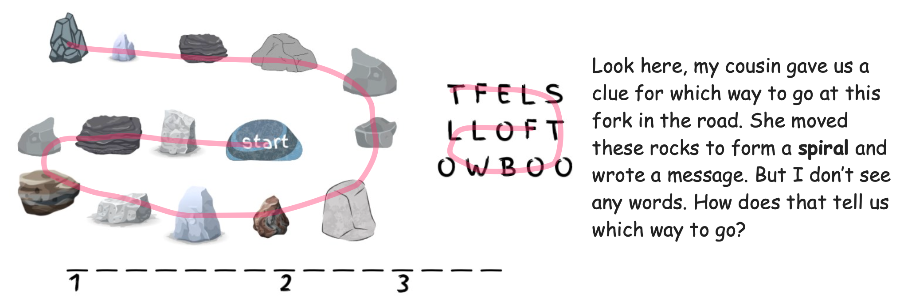
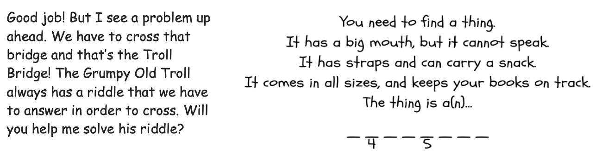
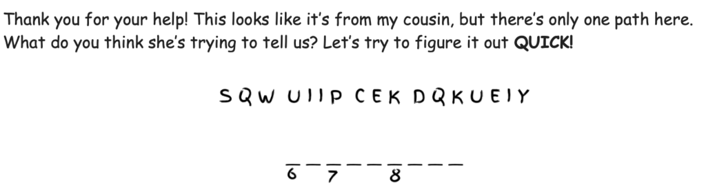
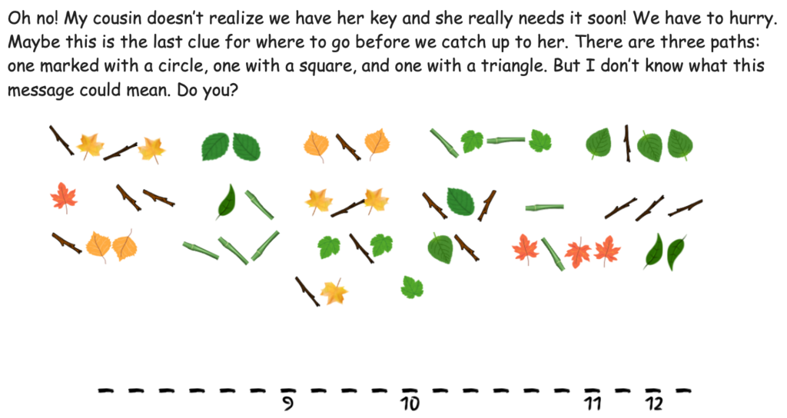
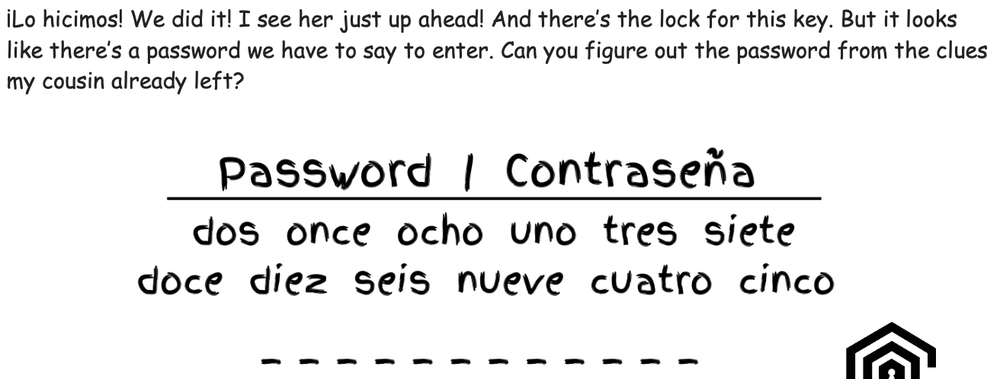

# The Key to the Garden Adventure (Jr Crypto Puzzle) Writeup

## Puzzle Info

The JRC puzzle was released a day early this year, but we did not notice it was published until an hour before the competition began. JRC is usually an easier puzzle with multiple steps, and as such is a great warmup for the rest of Gold-bug.

This year the puzzles were themed after Dora the Explorer and involved four intermediary puzzles, of which the solutions were combined into a final puzzle at the end.

## Solution

The first puzzle said Dora left a clue by spiraling rocks and writing a message. The rocks and the message were orientated in similar positions and the rocks had one labeled start. Beginning at the start rock and spiraling leftwards, we traced the letters "FollowBootsLeft".

The next puzzle was a classical Dora-style riddle from the [Grumpy Old Troll](https://dora.fandom.com/wiki/List_of_the_Grumpy_Old_Troll%27s_riddles). Googling did not reveal the solution. But ChatGPT-5 one-shot the riddle. The thing is a "backpack".

We did not solve the third puzzle. We tried vigeniere cipher with quick as the key. Realizing we were not making progress, we decided to skip it and come back later if we needed the final solution. Luckily we did not need to, and were able to guess the final answer from the other data points.

Coming back after completing JRC, with the numbered letters filled out, we figured out the message was intermixed with the word "quick". Taking every other letter, we get: "SwipedKey". In retrospect, we should have noticed the solution was half the length of the ciphertext and used that hint to guide our cryptanalysis.

The fourth cipher was drawings of leaves and sticks, chunked into multiple strings. Two elements, so our first thought was morse code. Applying sticks as "-" and leaves as ".", we decoded the message to "CircleMarkToDoraLine".

Finally, the last puzzle had 12 letters to fill in, lining up with the twelve numbered letters above. The password prompt listed numbers in Spanish, giving us an order. Inputting the letters we knew: "Ol?Fl?nt?Map". Luckily, one of us had recently read Treasure Island and remembered that Captain Flint’s map was the instigating item of the story. Entering "OldFlintsMap" into the Gold-bug challenge website, we saw the sweet letters "CORRECT" scroll by - and like that we had solved our first puzzle.

\<solution\>OldFlintsMap\</solution\>
