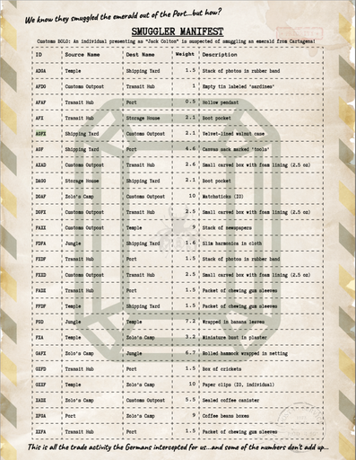

# Smuggler's Manifest Puzzle Writeup

## Puzzle Info  

The Smuggler's Manifest puzzle is contained within this ship manifest, following the travels of Jack Colton and his smuggled emerald. For every stop that our fictitious ship reached, the manifest records the origin, next stop, an item weight, and the item description. The text scribbled at the top says, "We know they smuggled the emerald out of the Port...but how?"



## Solution

Besides the nod to the beloved 1984 film, *Romancing the Stone*, the manifest also provides a picture of all the ship's travels. Taking this picture idea literally, our first step was to construct a graph depicting the various locations as nodes with the "Source Name", "Dest Name", and "Weight" as weighted edges between them.  This step was mostly to help us understand what was going on as we attempted to figure out the direction this puzzle was meant to take. 

At this moment, we realized that all the `ID` fields only consisted of the letters ADGFX. When alphabetized, this spells out [ADFGX, a German encryption scheme from WW1](https://en.wikipedia.org/wiki/ADFGVX_cipher). This is clearly no coincidence, and with this in mind, we set out to see how we could extract the information we needed to find our flag by finding the correct arrangement / interpretation of the `ID`s.

To encrypt a plaintext, the ADFGX scheme requires a table called a [Polybius square](https://en.wikipedia.org/wiki/Polybius_square), as well as a "permutation key." For a more detailed explanation, see the 2 wikipedia links above this. If you don't want to click away, here is our quick summary:

> The rows and columns of a 5x5 table are labelled both with A, D, F, G, X, and the cells are filled with any alphabet that the plaintext is a subset of. The plaintext can thus be transformed into a series of coordinates, where instead of numbers, we use the column and row. For example, a resulting string of `AFDAGX` would represent the character in the 1st row, 3rd column, then the character in the 2nd row, 1st column, and lastly the 4th row and 5th column. 
> 
> The next step is to take a permutation key, and construct another table where the columns are labelled with each letter of the permutation key (and no row labels). We write the coordinate-string from the previous step into this table, wrapping around when we reach the end of a row. For example, if our key is `key`, and we have our previous `AFDAGX`, then the resulting representation is `k -> AA, e -> FG, y -> DX`. If we order these groups alphabetically according to the key, we finally get our ciphertext: `FG AA DX`. 

--- 

Looking at the manifest again, we see that the items change at every stop, meaning that we can't necessarily find some correlation by tracking the items along the ship's journey. However, each item's weight never changes when it appears at a location--with the exception of the "Small carved box with foam lining (2.5 oz)," which is, oddly, weighed at 2.6oz at entry no. `AXAD` from the customs outpost to the transit hub. 

We can see that the smuggling probably happened at this moment. With the help of our favorite team member, ChatGPT, we calculated that the length of the ciphertext should be 24 characters, since each character turns into 2 coordinate characters (if we are to keep with the theme of 12-long flags, which has been the case for all the other puzzles so far). 

Since there are clearly more than 24 characters among all of the `ID`s, it follows that our ciphertext must be some subset or arrangement of 6-8 `ID`s (they are all length 3 or 4). 

At this point, we also feel certain that this combination of `ID`s must be constructed from the path taken to smuggle the emerald (thinking back to our original graph idea). 

Separately, our team also checked the total amount of weight going in and out of each location. For example, the inbound weight to the shipping yard is `1.5 + 2.1 + 1.6 + 1.5 = 6.7`, and the outbound weight was `2.1 + 4.6 = 6.7`. Doing this for all of the locations, we found that only the `jungle` and the `port` had different total weights going in than going out. Moreover, the `jungle` had exactly 2.1 units of weight *more* when leaving, while the `port` had exactly 2.1 units of weight *less* when leaving. Thinking to a hint provided from earlier:
>[MAN] It’s harder to “hide” extra weight in fixed-unit items than in items whose weight can vary

We also noticed that all the items passing through the `jungle` and `port` are all variable weight items (like a "Canvas sack marked 'tools'"). 

---

Combined with the earlier finding that the small box changed weight, we can begin to piece together our story. Perhaps, at the `jungle`, our thieves stole the emerald from the small box and hid it in a variable-weight item, and then stuffed the box with other matter, but mistakenly added .1 units in excess. Then, at the `port`, our thieves left the emerald onshore. 

This suggested to us that we should try finding a path starting at `jungle`, going through the `AXAD` edge, and then ending at `port`, in order to find the path the emerald travelled. We forced our ever-hardworking ChatGPT to try to come up with a path fitting these constraints, but it wasn't giving us anything that seemed to decrypt into anything meaningful. We and ChatGPT reasoned that the path should also contain no cycles, and that the only fixed-weight edge should correspond to the box--all the other items should be variable weight (an assumption made from the hint). With these constraints, ChatGPT gave us these two path-strings:

```
FGDFXAXADXAXADAFXDAGGAGF
FGDFXADGAFAXADAFXDAGGAGF
```

---

At this point, we still need to find the actual layout of the alphabet in the Polybius square, and to figure out what the permutation key was, in order to decrypt. We decided just to try the simplest thing, which was to fill the square with just the alphabet (combining `i` and `j` into one cell, just like wikipedia shows, in order to fit 26 characters into 25 cells). We thought about what the permutation key would be, and starting by trying relevant words like Colton, cartagena, el corazon (the name of the emerald in the movie reference), etc. 

None of these gave a fruitful answer. At this moment, a different teammate was brought in to try different keys, just in case. Somehow, no one had thought to use `emerald` as a key yet! Due to a [telephone](https://en.wikipedia.org/wiki/Telephone_game)-style miscommunication, this person assumed that the first path-string had been attempted with every reasonable key but the second path-string had not been tried yet, so decryption continued on the second path-string, to no avail. To our great fortune, the teammate, out of pure boredom, tried the first path-string again, this time with emerald, and we got our flag: `WALLETPICKER`. We were about 40 years too late to stop the movie emerald thief, but at least we managed to finish this puzzle!


