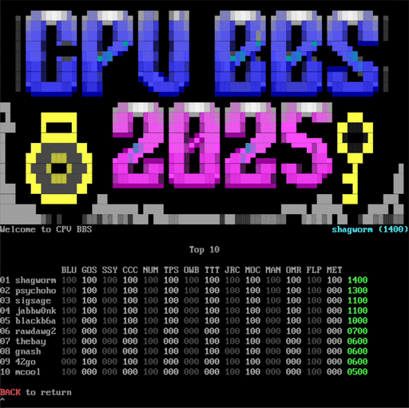

# Meta: The Treasure of Legrand Puzzle Writeup

## Puzzle Info

The final puzzle is the meta puzzle. It uses the solutions from previous puzzles as necessary steps. This is the first year our team has reached the meta puzzle during the competition. Most years it remains completely unsolved during the competition hours. Not this time!

The puzzle is contained within a map to buried treasure:

This year, the meta puzzle has everything you could ask for from a puzzle hunt: suspense, intrigue, red herrings, and two teams racing neck-and-neck for the prize.

But first, a well-earned break! After solving the second-to-last puzzle at 8pm on Saturday, we were two puzzle solves ahead of second place, we went out for a team dinner. At 11pm, while strolling along the Vegas Strip, our team checked the scoreboard: **psychoholics**, last year’s winning team, had caught up to us, completing 13 out of 14 puzzles. The entire competition came down to who could complete the final META puzzle. We rushed back to the hotel to race towards the finish line. What follows is 12 hours of non-stop gold-bug action!

## Solution

When working on the other puzzles, we noticed each puzzle was themed to an adventure story and many of the solutions were references to adventure stories. Previously, this helped us solve some puzzles: for example noticing the partial solution we had for the JRC puzzle was a reference to Treasure Island. But the JRC puzzle was themed after Dora… and the answer was Treasure Island. A different puzzle, TPS was themed after Treasure Island. After solving a few more puzzles, we confirmed the pattern: solutions were referencing themes from other puzzles.

The meta puzzle’s map had the line _"Your first clue lies above, with each solved puzzle pointing the way for your next step"_. The first clue was FLP, which was solved by putting the gold coin on the map, and thus the starting point. Then FLP would reference another puzzle with its solution, which would in turn reference another puzzle with its solution — charting a path. We put each puzzle, its theme, and its solution into a spreadsheet, and tried to chart a path between puzzles.

We found most of the solutions were quotes from a story. We initially created an incorrect mapping with the following mistakes… we also forgot to include one:
| Puzzle | Puzzle Theme | Solution | Solution theme | Confidence / Reasoning |
| :---- | :---- | :---- | :---- | :---- |
| FLP | N/A (Start) | WrongLeftEye | Goonies | Medium. One-eye willy has a missing left eye |
| SSY | Pirates of the Caribbean | HowNotToBulb | The Mummy | Lowest. A bulb is a plant's underground storage organ. A mummy is an underground sack of organs… we were stretching |
| CCC | Indiana Jones | MarkTheSpots | The Gold-Bug | Low. The Gold-Bug has a character mark a spot… "removed the peg which marked the spot where the beetle fell" |
| NUM | The Gold-Bug | TakeMineBack | National Treasure | Lowest. Taking back the declaration of independence |

There were a few connections we were less than confident about, but we had no other ideas and we _had_ made a path, like the map suggested. It was not until later, when reading The Gold-Bug story out loud to each other at 3am in the morning, that we realized our mistake. We narrated the character putting a gold bug beetle into the wrong eye of a skull… at which point we collectively realized our mistake: WrongLeftEye was a reference to The Gold-Bug! We re-charted the connection between clues, finding the correct path; all steps were now high confidence backed by quotes from their respective media:

| Puzzle | Puzzle Theme             | Solution      | Solution theme           | Evidence                                                                                                                             |
| :----- | :----------------------- | :------------ | :----------------------- | :----------------------------------------------------------------------------------------------------------------------------------- |
| FLP    | N/A (Start)              | WrongLeftEye  | The Gold-Bug             | A character drops a gold-bug beetle through the skull’s wrong eye                                                                    |
| NUM    | The Gold-Bug             | TakeMineBack  | Goonies                  | "This one, this one right here, this was my dream, my wish, and it didn't come true. So I'm takin' it back. I'm takin' 'em all back" |
| MOC    | Goonies                  | DryLandFound  | Waterworld               | "then Dryland is that way"                                                                                                           |
| OWB    | Waterworld               | HaveToSayMap  | Dora                     | "You have to say, 'Map’."                                                                                                            |
| JRC    | Dora                     | OldFlintsMap  | Treasure Island          | Old Captain Flint had the map to treasure island                                                                                     |
| TPS    | Treasure Island          | IAmDishonest  | Pirates of the Caribbean | "I'm dishonest, and a dishonest man you can always trust to be dishonest"                                                            |
| SSY    | Pirates of the Caribbean | HowNotToBulb  | National Treasure        | "I found out ways how not to make a light bulb."                                                                                     |
| GOS    | National Treasure        | TheWrongBank  | The Mummy                | "Hey Beni\! Looks to me like you're on the wrong side of the river\!"                                                                |
| BLU    | The Mummy                | PreferToBask  | ElDorado                 | Disney’s Road to El Dorado has the line "They wish to bask\!"                                                                        |
| OMR    | ElDorado                 | CrockSkinBoot | Romancing the Stone      | "I like the crocodile boots."                                                                                                        |
| MAN    | Romancing the Stone      | WalletPicker  | TinTin                   | Aristides Silk stole wallets in The Secret of the Unicorn                                                                            |
| TTT    | TinTin                   | WhyTheSnakes  | Indiana Jones            | "Why did it have to be snakes"                                                                                                       |
| CCC    | Indiana Jones            | MarkTheSpots  |                          | Final Puzzle answer. End of the path has the treasure\!                                                                              |

We have an order! Step 1 completed!

---

Step 2: We noticed every location on the map (and there were a lot of them) were references to one of the adventure stories. Therefore, we dumped every location, its coordinates into a spreadsheet, then tried to assign their references; to the best of our abilities. Some had no reference (hi "Tseven Bay") and others we could not determine.

We thought each step in the path could be a letter. We tried to mark every location that referenced the theme of the path step, hoping to see a letter or another hint revealed. This approach led us nowhere. We tried assigning each location to letter pairs to no avail.

Luckily, there was a single hint released:

> Hint provided: _\[MET\] My father told me often about Grandma Maud and her funny pirate joke she used to tell. There were 3 pirates who had to work together to read the charts. One of them had a hook for his left hand. My father didn't remember the punchline even though it was long. I'll give him some latitude since it was odd._

We interpreted the hint as the puzzle solution was the pirate joke and the rest of the hint gave clues to solve the puzzle. We learned maud is another word for plaid, like a checkerboard. And the clue paired "even" with "long" and "latitude" with "odd". We thought to grab only the locations with even longitude and odd latitude. Sketching the bars on our map, it quickly looked "maud", making us think we were on the right track.

But no matter how we selected locations (and many were on the edge) or tried to combine them, we could not come up with an answer. We tried pairing answers or taking three, then using the midpoint. We even tried finding all the locations named after captains for each theme. No dice.

At this point at 4am, our group split up. Half our team caught the 6am flight home, while the rest grabbed a few hours of sleep, puzzles and pirates dancing in their dreams. At 8am we awoke, energized by coffee, sunlight, and the dropping of a new hint: one that changed everything:

> Hint provided: _\[MET\] My father was not able to solve some of the clues, but he was certain that the first step was just north of Bootstrap Cliff._

Before we got the hint above, we thought the starting points were cities and we were plotting a path from city to city. But there was no city directly "north" of Bootstrap Cliff; we assumed the city was the Trinity Canyon, which was northeast of Bootstrap. When we tried to confirm with the puzzlemakers, we were hinted that we should "take another look at the compass orientation" if we thought that a northeast city was north of bootstrap. This is when we thought back to the grid lines and precise coordinate system. It just so happened that "just north" of Bootstrap Cliff was the grid coordinate (17, 8).

This line of reasoning was all but confirmed with a hint that followed shortly: _\[MET\] If you want to remember a secret location, you may not want to mark it on a map, but instead leave clues to a precise coordinate._

Then, we had to figure out how the first ordered clue, WRONGLEFTEYE, related to (17,8). We went back to the initial hint which included the phrase: _"My father didn't remember the punchline even though it was long. I'll give him some latitude since it was odd."_ One of our team member took the ascii sums of all the odd indexed values through the following formula: SUM(value of letters) % 26 \= (W \+ O \+ G \+ E \+ T \+ Y) % 26 \= (23+15+5+7+20+25) % 26 \= 95 % 26 \= 17\. Bam\! We quickly sanity checked the even letters: (R \+ N \+ L \+ F \+ E \+ E) \= (18+14+12+6+5+5) % 26 \= 60 % 26 \= 8\. Double bam\!\!

We had successfully mapped the first clue to the first coordinate. We wrote up a script for the rest of the combinations and got the following coordinates per clue:

**`WrongLeftEye`**  
**`17, 8`**  
**`TakeMineBack`**  
**`11, 6`**  
**`DryLandFound`**  
**`11, 23`**  
**`HaveToSayMap`**  
**`17, 25`**  
**`OldFlintsMap`**  
**`13, 24`**  
**`IAmDishonest`**  
**`20, 12`**  
**`HowNotToBulb`**  
**`2, 9`**  
**`TheWrongBank`**  
**`21, 13`**  
**`PreferToBask`**  
**`15, 17`**  
**`CrocSkinBoot`**  
**`11, 3`**  
**`WalletPicker`**  
**`12, 19`**  
**`WhyTheSnakes`**  
**`3, 25`**  
**`MarksTheSpot`**  
**`14, 21`**

The hint _"There were 3 pirates who had to work together to read the charts. One of them had a hook for his left hand"_ was telling us to use mod 26, since the 3 pirates can only count to 26 (5 hands, 1 hook).

With 13 clues and a 12 letter target, we were extremely intent on trying to use the 'path' idea using pairs of locations to produce vectors that map to our 12 letters. We tried a lot of different vector operations (mod 26\) to generate letters based on the adjacent coordinates. We tried using the absolute distance (flooring and rounding up values), cartesian distance, and vector addition to try and get the semblance of valid characters. However, we kept getting multiple weird values, such as multiple 17’s (or Q), that didn’t make sense in the final answer.

Finally, two of our teammates went back to the basics: "How does a treasure map work?", "X marks the spot". Presto\! We needed to map the path between coordinates, then look for all the places the lines intersect.

Hearts beating in our chests, we saw the treasure's path form ahead; another crew mere moments behind. We first counted intersections as we saw on the map, after filling in all the paths. We got "IDDINERED", which was not producing a word for us. We then realized we should be tracing the path as we draw it, so we should only count an intersection when the second line crosses over the first. We traced the path and pulled the locations where X marked the spot:

**K**nights Cove  
**I**ndependence Rock  
**D**eacon Marsh  
**D**eath's Head Lake  
**I**nterceptor Lake  
**N**orthcreek  
**H**addock River  
**E**nola Field  
**R**ackham Dale  
**I**mhotep Falls  
**T**annobok River  
**E**astglades  
**D**o Good Woods

Taking the first letter of each, we get: KIDDINHERITED. Our team submitted it from a taxiing plane:

\<solution\>KiddInherited\</solution\>

We cheered\! At 10:40am, after over 48 hours of Gold-Bug, our fourth year competing: we won; we completed every puzzle; and, most importantly, we sailed with the greatest crew we could ask for\!

