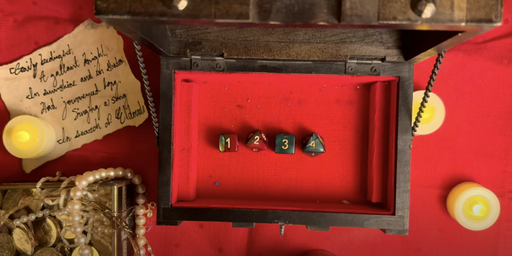
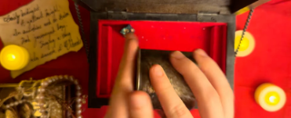
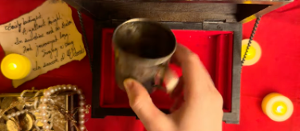

# One More Roll Puzzle Writeup

## Puzzle Info


The puzzle consists of a youtube video link here (screenshot above): https://www.youtube.com/watch?v=I0Tq7rzELBA&t=35s.

The above scenery is shown in a single shot. A mysterious hand puts a variable number of die into the cup and shakes it to lay out the die. 1 to 4 dice (2 six-sided, 2 eight-sided) are rolled out. The hand arranges the dice in a certain order, mostly in the order they are rolled. There is a poem in the corner.

## Solution

On our first play through the video, we simply wrote down our observations. There were 12 rolls, immediately indicating to us (given that it is a one-star puzzle) that each roll was associated with an answer character.

We wrote down all the numbers in the order they appear and also note what sided die was used, since only d6 and d8s were used:

```
6718 (die 6868)
344 (868)
811 (868)
2155 (8866)
564 (866)
433 (688)
72 (88)
85 (86)
4615 (6688)
724 (868)
711 (886)
4 (8)
```

We tried the simplest solutions of adding the die values to get to alphabet characters (either alphabetically 1 or 0 indexed or ascii). This did not work.

We then tried to use the order of sided die mapping a 6 sided die or a 8 sided die to a binary value \- i.e 6868 would be 0101\. We were hoping that this would somehow represent either morse code, a bacon cipher, or a binary representation of our number to alphabet character strategies (1/0 indexed alphabet value or ascii). None of these seemed to work.

Our next strategy was to look around the puzzle for other clues. We couldn’t make out all the words, but the puzzle makers showed us that it was part of the poem [_“Eldorado” by Edgar Allen Poe._](https://www.poetryfoundation.org/poems/48634/eldorado-56d22a0920778) The puzzle makers made it clear that reading this was not necessary for the puzzle solution, but helpful thematically.

We then realized an obvious fact (with the help of the puzzle makers) that the video is filmed in one take. This indicated to us that very clearly (unless the puzzle makers are incredible dice rollers), the value of the die rolled and the order of the sided-die are most likely irrelevant.

We re-watched the video and noticed that there were two distinct shaking patterns \- horizontal and vertical.


Horizontal shake (above) and vertical shake (below)


We tried to apply the two shaking patterns to morse code. If multiple dice were rolled in the same shake, then those two were consecutive morse code values.

We tried first that horizontal shakes were dashes and vertical shakes dots.
| -.-. .-. --- -.-. -.- ... -.- .. -. -... --- --- - ... |
| - |

This gave us the correct answer: <result>CrockSkinBoot</result>
