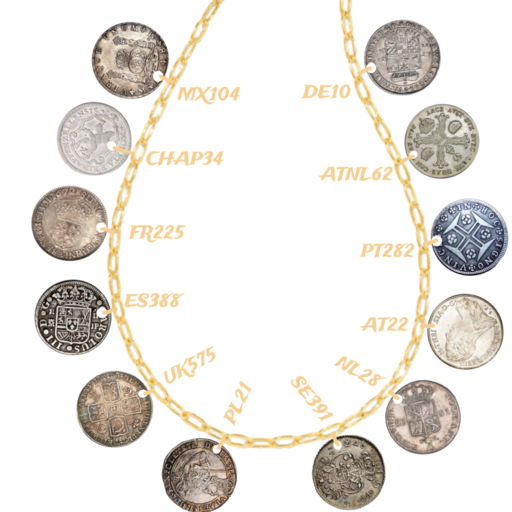

# Old World Baubles Puzzle Writeup

## puzzle Info

This puzzle consisted of three elements: a graphic from the 1995 movie Waterworld, a text passage, and an image of twelve coins on a chain.

The graphic did not serve to help solve the puzzle, it only served as theming.

The passage was as follows:  
|Sea-eaten coins... the land-sicks used to kill for such garbage. They're just worthless sinkers now, fit only to weigh down a dead man's pockets. But every now and then, you hear whispers carried on the tides, stories of pirates and forgotten maps or hidden ciphers etched into their rotten surfaces. Could be just more stories, or maybe... just maybe, there's a reason the ancients held 'em so dear. A secret, perhaps, for those with the eyes to see through their silver gleam.|
| :-: |

## Solution

Though we spent some time considering the weight of the coins ("fit only to weigh down a dead man’s pockets"), nothing came of it. Indeed, the important part of the passage laid in the last sentence: "A secret, perhaps, for those with eyes to see through their silver gleam". We realized that this meant we needed to look through the coins in some way.

We first identified that the twelve labels \- MX104, CHAP34, FR225, etc. \- started with some sort of country code. Ten of them quickly jumped out to us:

- MX \- Mexico
- FR \- France
- ES \- Spain
- UK \- The United Kingdom
- PL \- Poland
- SE \- Sweden
- NL \- The Netherlands
- AT \- Austria
- PT \- Portugal
- DE \- Germany

Further research later revealed the final two:

- CHAP \- Switzerland, specifically from the Appenzell canton
- ATNL \- Belgium, which was once called the Austrian Netherlands.

After some Google reverse image searching, we noticed a pattern. The numbers following the country codes referred to a specific reference number from the Standard Catalog of World coins. For example, the UK575 coin is [this coin](https://en.numista.com/catalogue/pieces13105.html), which has a reference number of KM\#575. This was important because it allowed us to confirm the exact mintage of a coin, which was important as many coins had slight variations made year to year. We could not find the correct version of the Polish coin.

We noticed that each coin had a hole punch in it. Using the hint that we had to "see through" the coins, we set about determining which letters were punched out. Since many of the coins did not have letters punched out on the side facing us, we reasoned we needed the letters in the punched out section of the coins on the reverse side. This proved _much_ more challenging than expected.

The largest obstacle was determining the "die axis" of the coins; ie: which way they flipped. We found three strategies to estimate die axis: 1\) some coin databases recorded the die axis of their coins; 2\) we found the coins in sleeves on ebay and other auction sites which displayed both sides of a coin in a fixed case; 3\) if all else failed, we used listed images of both sides of a coin and aligned their axes using visible damage on the edges. For all coins we used Figma to flip the coins and superimpose the holes. After many hours of finding, matching, and estimating alignment, we ended up with the following string, where \[\] represents letters we couldn’t agree on:

`EAVET[?][EDSR][AN][DY]MAP`

Even though we were confident about the letter E through our methodology, we recognized that "EAVE" was not very likely the first word of the answer, as all of the other answers thus far had been reasonably common words. So, we assumed our die axis was incorrect and grabbed the other possible letters: H or P, giving us HAVE or PAVE.

After much thought, re-checking every coin multiple times (usually leading to more confusion), and many, many anagram solvers using our candidate letters, we eventually found the correct answer:

\<solution\>HaveToSayMap\</solution\>
