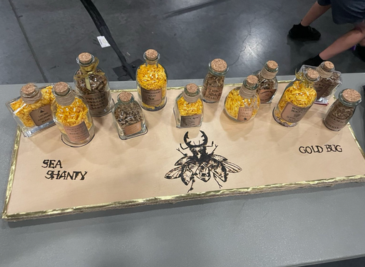

# Sea Shanty Puzzle Writeup

## Puzzle Info

The Sea Shanty puzzle appeared on a pirate themed website with a story and lyrics to a sea shanty separated by an image of 12 bottles of rum. The story referenced Disney’s Pirates of the Caribbean movie. The 12 bottles were also set up at the Gold Bug competition table.

| You and the crew of the Black Pearl have gone to the port of Tortuga upon Captain Jack's orders to find the next fragment of the treasure’s map. A surly sailor sits alone at his table, his cup near empty. Rumor has it he’s the only soul alive who knows where a final clue lies. You've just got to coax it from him before dawn.  You all squeeze around a table until there's no space left. With bottles of rum and a song in the air, you gather round to learn his tale... |
| :------------------------------------------------------------------------------------------------------------------------------------------------------------------------------------------------------------------------------------------------------------------------------------------------------------------------------------------------------------------------------------------------------------------------------------------------------------------------------------------: |

| The crew begins singing a shanty...   "Twelve bottles to loosen tongues, Three swigs ahead since night was young. Four cups aligned & tales abound, Spin the table starboard round. He slumped upon the table flat, Then chose to share where secret's at. On th'twelfth cup the lush did drink He etched the truth he’d tried to sink  Eleven bottles to loosen tongues, Three swigs ahead since night was young. Four cups aligned & tales abound, Spin the table starboard round. He slumped upon the table flat, Then chose to share where secret's at. On th'eleventh cup the lush did drink He etched the truth he’d tried to sink..."  The shanty continued until the last bottle was gone. |
| :--------------------------------------------------------------------------------------------------------------------------------------------------------------------------------------------------------------------------------------------------------------------------------------------------------------------------------------------------------------------------------------------------------------------------------------------------------------------------------------------------------------------------------------------------------------------------------------------------------------------------------------------------------------------------------------------------------------------------------------------------------------------------------: |

## Solution

Our first point of note was the puzzle involved 12 bottles of rum and the song was counting down from 12 to 0. Likely, there was one letter per bottle. And the song likely told us how to extract the letters. Sitting down in front of the in-person bottles, we imagined the shanty taking place before us.

We remembered that last year’s Gold-bug challenge had a dancing routine involving switching partners. We too quickly guessed that there were 12 pirates drinking at the same time, one bottle each, and swapping bottles around, until one of them slumps on the table and gets removed, giving us a letter. This approach has us interpret the poem with bottle meaning bottle, swig meaning bottle, cups meaning bottle, and finally cup meaning word. This… did not make sense. I got lost in my priors from previous years and could not readjust.

When pondering this discrepancy, we were asked: "do you drink 12 bottles at the same time?" While pirates may go hard and require a bottle per person, our group prefers to share one bottle at a time. This epiphany let us re-define the poem, where: bottle means bottle, swig means transforming the bottle’s name, and cup means letters. That sounded more consistent!

In the page’s source code, we found the figure’s figcaption transcribed the bottle names and gave us their order.

| The image shows 12 distinct bottles of rum on wooden crates with pirate-themed labels. From left to right the bottles read: 12. Sailing Hatchway Blend, 11. Seething Watch Golden Blend, 10. Twisted Corsair Black Label, 9. Old Voyage Silent Proof, 8. Shrouded Mast Smugglers Cut, 7. Rusty Quay Special, 6. Iron Squalq Select, 5. Cursed Flag Twelve, 4. Crimson Skull Masters Blend, 3. Wicked Watch Spiced Rum, 2. Black Sea Double Barrel, 1. Black Seas Reserve. The backdrop shows a moonlit ocean with pirate ships and palm trees silhouetted against the night sky. |
| :--------------------------------------------------------------------------------------------------------------------------------------------------------------------------------------------------------------------------------------------------------------------------------------------------------------------------------------------------------------------------------------------------------------------------------------------------------------------------------------------------------------------------------------------------------------------------------------------------------------------------------------- |

We distilled the song into an algorithm, interpreting each keyword as a part of the cipher:
Take the nth bottle name (12..1, left to right)
Three swigs = some transformation
Align four cups = lay out letters in a grid (each name was a multiple of four!)
Spin starboard = rotate the grid to the right, like a ship turning starboard
Slumped flat = lay the grid letters down
Nth cup = take the nth letter
n-1. Repeat until n=0

Our overall approach seemed solid, but the individual steps gave us a hard time. We came up with many interpretations for each, but none revealed the clue.

We wrote a monstrosity of python code trying to simulate every combination of bottle access orders, swig transformations, aligning letters in the grid, grid rotating different directions, flattening starting from different points, and letter index access (0 or 1) that we could think of.

Slowly, by discussing with the entire team, eliminating combinations, and integrating hints from puzzle organizers, we came to the conclusion that: swig was a caesar cipher; aligning cups meant laying out the letters in a grid with four columns laid out left-to-right then down; spinning starboard is rotating the grid to the right; flatten the words is reading the same order we wrote them down; and finally we select the nth letter.

Sing with us:
Sing with us, Muse, and through us tell your secret:
| Lyric | State |
| :-: | - |
|Twelve bottles to loosen tongues,| Sailing Hatchway Blend |
|Three swigs ahead since night was young.| vdlolqj kdwfkzdb eohqg |
|Four cups aligned & tales abound,|v d l o l q j k d w f k z d b e o h q g |
|Spin the table starboard round.| o z d l v h d w q d q b f j l g e z k o|
|He slumped upon the table flat,| ozdlvhdwqdqbfjlgezko|
|Then chose to share where secret's at. On th'twelfth cup the lush did drink He etched the truth he’d tried to sink| ozdlvhdwqdq**b**fjlgezko 123456789012|

Repeat for each bottle, and we got: blubotoonwoh. Reversing that, ordering letters increasing (1..12) by bottle number, we got: hownootobulb. Not the flag.

After repeated attempts and becoming certain we had the right approach, we talked to the organizers and helped find a mistake. We helped them debug, finding that one of the letters was not set right. We used our script to print the intermediary steps, locate the offending letter (changing squall to squalq in the \#6 bottle), and find a correct one! We helped fix the puzzle. For our help, we received a Gold Bug pin!

\<solution\>HowNotToBulb\</solution\>
_(We don’t know what it means either)_
