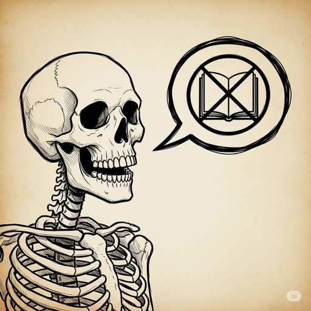
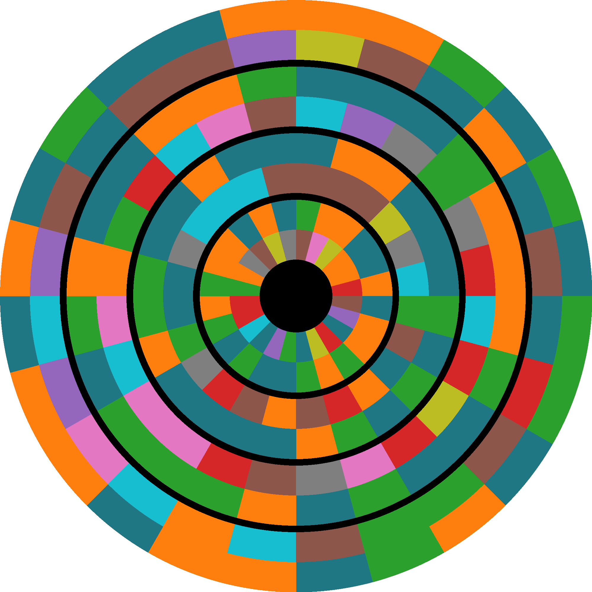

# Treasure Pursuit Puzzle Writeup

## Puzzle Info

This year, Treasure Pursuit was the pirate themed "grand event", which involves a series of challenges one after the other, usually with a "meta" challenge at the end using the previous answers to find the puzzle’s solution. It’s like a mini-gold bug. Each mini-puzzle solution appends to the URL, revealing the next puzzle.

## Solution

### The Adventure Begins

Challenge: [https://goldbug.cryptovillage.org/puzzles/TreasurePursuit](https://goldbug.cryptovillage.org/puzzles/TreasurePursuit)

The first puzzle, located at the starting URL [https://goldbug.cryptovillage.org/puzzles/TreasurePursuit/](https://goldbug.cryptovillage.org/puzzles/TreasurePursuit/), showed a ship with 17 colorful flags draping the forestay. One of our teammates quickly recalled the [Marine Signal Flags](https://en.wikipedia.org/wiki/International_maritime_signal_flags) letter flags:

Translating each flag to a letter, we got: johnstoneschrysal. Capitalization is important in the grand event puzzles, as the URLs are case sensitive camelcase. Some google-fu gave us "Chrysal; or, The Adventures of a Guinea (1760)" by Charles Johnstone. We converted our answer to **JohnstonesChrysal**, appended the url, and moved onto the next challenge.

### Cook's Apprentice

Challenge: [https://goldbug.cryptovillage.org/puzzles/TreasurePursuit/JohnstonesChrysal/](https://goldbug.cryptovillage.org/puzzles/TreasurePursuit/JohnstonesChrysal/)

The puzzle starts with the pirate Long John Silver informing us "ye'll need to learn \[pirate\] lingo". Then a crossword puzzle with 12 words on the grid and 12 dominos counting from 1 to 12 overlapping blank letters, one on each word.

Additionally, there were 12 images on the page, representing overly literal interpretations of pirate lingo. With help from Lewes’s dictionary of pirate lingo, we filled in the 12 phrases:

|           Lily-livered           |                Scallywag                |  All hands on deck |
| :-------------------------------------------------------------------: | :-----------------------------------------------------------------------: | :----------------------------------------------------------: |
|      Shiver me timbers      |                Bilge rat                |   Give no quarter    |
| Dead men tell no tales | Three sheets to the wind |   Pieces of eight    |
|        Walk the plank         |            Weigh anchor             | Davy Jones Locker |

Then we inserted the wording into the crossword puzzle. Thankfully, each phrase had a unique length, allowing us to assign crossword answers to rows by line length.

Taking the letters on the domino squares and ordering them by domino number, we get: **CristosCache**. A reference to the treasure hidden on the island of Montecristo in the "Count of Monte Cristo" by Alexandre Dumas.

### A Grand Carousing

Challenge: [https://goldbug.cryptovillage.org/puzzles/TreasurePursuit/JohnstonesChrysal/CristosCache/](https://goldbug.cryptovillage.org/puzzles/TreasurePursuit/JohnstonesChrysal/CristosCache/)

The next puzzle was themed around a pirate gig. The prompt described a dance:
| Let's kick up our heels with a chanty or two, and get to know one another\!\<br/\> When we be dancin', one matey takes the lead, while the other be followin'. Switching back and forth, see?\<br/\> When ye find a good partner, a grand new jig is born\!\<br/\> Aye, look\! Observe the skilled athlete leads the sculpture to form the dance of a pirate avian companion\!\<br/\> The leads stand fast and await their dance partners, and the follows help show 'em the way\! |
| :--------------------------------------------------------------------------------------------------------------------------------------------------------------------------------------------------------------------------------------------------------------------------------------------------------------------------------------------------------------------------------------------------------------------------------------------------------------------------------- |

Then there are 12 leads and 12 follows, given in two separate tables. From the puzzle’s prompt and our knowledge of social dance, we knew the leads and follows needed to be paired, then they would create a new "partner" that would lead us to the answer.

One of the lines underlined three phrases, we thought this was acting as an example. A skilled athlete is a PRO and a sculpture is ART. A pirate avian companion is a PARROT. Together, PRO \+ _art_ \= P*a*R*r*O*t* when lead and follow are "switching back and forth". This served as a basis for solving the puzzle. We needed to solve the crossword prompt for each lead and follow, getting short word answers, then combine them to produce 12 new words.

| Lead hint              | Lead word |     | Follow hint          | Follow word |
| :--------------------- | :-------- | --- | :------------------- | :---------- |
| Mammal feature         | HAIR      |     | Allow (4)            | LET (4)     |
| Automobile             | CAR       |     | Apple or lemon (1)   | PIE (1)     |
| Prompt                 | CUE       |     | As well (3)          | AND (3)     |
| Crime solving agency   | FBI       |     | Bound (3)            | TIE (3)     |
| Auctioneer exclamation | SOLD      |     | Cap (6)              | HAT (6)     |
| Fish feature           | FIN       |     | Circle part (3)      | ARC (3)     |
| Enjoyment              | FUN       |     | Crimson (2)          | RED (2)     |
| Sorrow                 | WOE       |     | Donkey (2)           | ASS (2)     |
| Timer sediment         | SAND      |     | Joe’s or Jimmy’s (2) | HIS (2)     |
| Before, poetically     | ERE       |     | Night prior (3)      | EVE (3)     |
| Pub drink              | ALE       |     | Unusual (1)          | ODD (1)     |

Alas, hair and yet interleaved makes hyaeitr. The other rows were similarly nonsensical. After an embarrassingly long time trying to link leads and followers 1:1, we realized the follows were in alphabetical order and needed to be assigned to leads they fit. By matching the follows to the leads where they form words, we found the dancing partners:

| Leads | Follows | Combined    |
| :---- | :------ | :---------- |
| HAIR  | EVE (3) | HE**A**VIER |
| CAR   | HIS (2) | C**H**AIRS  |
| CUE   | ASS (2) | C**A**USES  |
| FBI   | ARC (3) | FA**B**RIC  |
| SOLD  | PIE (1) | **S**POILED |
| FIN   | RED (2) | F**R**IEND  |
| FUN   | LET (4) | FLU**E**NT  |
| WOE   | ODD (1) | **W**OODED  |
| SAND  | TIE (3) | ST**A**INED |
| ERE   | AND (3) | EA**R**NED  |
| ALE   | LID (6) | ALLIE**D**  |

Taking the letter at the index supplied by the follow, we get **AhabsReward**. A reference to Moby Dick’s Captain Ahab.

### Contempt and Scheming

Challenge: [https://goldbug.cryptovillage.org/puzzles/TreasurePursuit/JohnstonesChrysal/CristosCache/AhabsReward](https://goldbug.cryptovillage.org/puzzles/TreasurePursuit/JohnstonesChrysal/CristosCache/AhabsReward)

This one was a fairly straightforward puzzle. We were given the string LONGJOHNSILVER with a two-layer color encoding underneath. Each color pair, made up of 10 color options, represents a letter, confirmed by the repeating letters.

The color wheel underneath appears to be the puzzle to solve with distinct layers of the color code. The wheel has four layers.

The puzzle hint states:

- "four layers, from outer to inner" indicating that we should work from outer layer to inner layer.
- "Each layer speaks for itself but looks to its outer for instruction" means that each can be mapped or decoded individually but probably requires the previous layer to solve it or move on.
- "Ten colors appear, each holdin’ its own meaning throughout" means that the color combination of the ten colors does not change and should equal that of the Long John Silver key above.
- "Start at noon and work ye as a clock" means that we should start from the top, noon, and move clockwise decoding the letters.

We first tried mapping the colors to numbers, to create a formula we could apply to find letters. By laying out the letters we knew from the key, we saw a pattern where nearby letters shared a top color and each letter up incremented the colors the same way, in the order: blue, orange, green, red, purple, brown, pink, gray, yellow, cyan. The first color starts at blue, then increases after the second color resets after cyan. Applying this formula to the entire alphabet, we get the key:
| Letter | Number | Top Color | Bottom Color |
| :-: | :-: | :- | :- |
|A| 1 | Blue | Orange |
|B| 2 | Blue | Green |
|C| 3 | Blue |Red|
|D| 4 | Blue |Purple|
|E| 5 | Blue |Brown|
|F| 6 | Blue | Pink |
|G| 7 | Blue |Gray|
|H|8|Blue|Yellow|
|I| 9 | Blue |Cyan|
|J|10|Orange|Blue|
|K| 11 | Orange |Orange|
|L| 12 | Orange |Green|
|M|13|Orange|Red|
|N| 14 | Orange |Purple|
|O|15|Orange|Brown|
|P| 16
| Orange |Pink|
|Q| 17
| Orange |Gray|
|R| 18 | Orange |Yellow|
|S|19|Orange|Cyan|
|T| 20|Green |Blue|
|U|21|Green|Orange|
|V| 22 | Green |Green

|W|23|Green|Red
|X| 24
|Green |Purple|
|Y|25|Green|Brown|
|Z| 26 | Green |Pink|

The first layer (most outer) decoded to: _ROTATE_TWELVE_SKIP_NINETEEN_ (note: underscores added by us for readability). These are most likely instructions for the next layer of letters.

The second layer decoded to: _IDGVQMSWHCZGOWPPIZKBCSPY_. Then we did a caesar (rotate) cipher by (12) followed by a skip cipher (n=19), getting the result: _UNLOCK_WITH_BLAISE_USE_POLLY_

The third layer decoded to: _EOOHGIVETAWOAECGLTTGISIE_. Then we used vigenere cipher (created by Blaise de Vigenère) with key word "POLLY", to get result: _PAD_WITH_TI_CHAPTERXIII_TEXT_

The last layer (most inner) decoded to: _YPRAAMENJWRTBDTIWMVKQERG_. Using a one time pad cipher with chapter XIII of Treasure Island (theme of the puzzle), we got the final answer: _FINAL_X_ANSWER_X_POPPINS_FEED_. We plugged in **PoppinsFeed** to the URL and moved on to the next puzzle.

### To the treasure!

Challenge: [https://goldbug.cryptovillage.org/puzzles/TreasurePursuit/JohnstonesChrysal/CristosCache/AhabsReward/PoppinsFeed](https://goldbug.cryptovillage.org/puzzles/TreasurePursuit/JohnstonesChrysal/CristosCache/AhabsReward/PoppinsFeed)

This one was a doozy!! It took us the longer than all the other steps combined.

The puzzle contained the hint:
| Now count my words and take no breaks! Consider ye where yer path could lead - as a professional pirate! |
| :-: |

And song lyrics:
|When I was just a lad looking for my right vocation My father said "Now son, this choice deserves deliberation Though you could be a doctor or perhaps a financier Yes boy why not pursue you a more challenging career" Hey ho yo You'll cruise to foreign floors And you'll keep that mind and body sound By working out of doors True friendship and adventure are things we can't live without And when you're a professional pirate That's what the job's mapped out Now take Sir Francis Drake, the Spanish all despise him But to 'ol British he's a hero and they idolize him It's how you look at buccaneers that makes them bad nor good And I see us as members of a noble brotherhood Yo ho ho We're honorable men And before we lose our tempers we will always count to ten On occasion there will be someone you have to execute But when you’re a professional pirate You don't have to wear your suit I could have stayed a surgeon I like taking things apart I could have been a lawyer But I just had too much heart I could have been in politics 'Cause I've always been a big spender And me I could have been a contender Some say that pirates steal and should be feared and hated I say we're victims of bad press it's all exaggerated We'd never stab you in the back, we'd never lie or cheat We're just about the nicest guys you'd ever want to meet Hey ho ho It's one for all for one And we'll share and share alike with you and love you like a son We're gentlemen of fortune and that's what we're proud to be And when you're a professional pirate You'll be honest brave and free The soul of decency You'll be loyal and fair and on the square And most importantly When you're a professional pirate You're always in the best of company|
| :-: |

We were stuck on the actual lyrics of the song for way too long. During this time we followed a lot of red herrings, such as:

- Why the different combinations of "hey ho yo" in the chorus
- "Before we lose our tempers we always count to ten"
  - The combination of this line, along with the instructions: "Now count my words and take no breaks" led us astray counting intervals of 10 wherever we could.
- "Mapped out" the song on a map
- Any ciphers relating to Sir Francis Drake
- "One for all for one"
  - Thought this could have to do with palindromes, or the numbers 14, or 41\.

Then someone found the [song](https://disney.fandom.com/wiki/A_Professional_Pirate), "A professional pirate" from Muppet Treasure Island exists, where the lyrics originated. This was huge\! We now had a source for the lyrics!

We found that there were 13 different words from the original lyrics in the "A professional pirate" song and the words in the puzzle. These were:

- Right, yes, pursue you, yo, floors, that, things, mapped out, ‘ol, nor, yo, will, your, stayed

Now, as the directions said to count **my** words, so we assumed this meant the words that Goldbug changed. We counted what we thought was everything relating to these words:

1.  Their position on the line
2.  Their absolute position in the song
3.  Number of letters
4.  Every 10th character in the different words

None of the above techniques gave us any solutions. We also noticed that there were only different lyrics in _exactly_ the first half of the poem \- 22 of the 44 lines. We tried to mirror the positions of the changed words on the second half of the poem. Unfortunately the poem was not a palindromic shape, so this became difficult and did not give us any results.

We asked for a hint around now \- and were told we were on the right track with the counting of words. But we were stuck \- we couldn’t think of any more ways to count these words.

When we were stuck, a formal hint got released: _\[TPS\] When ye be singin' tis important to mark yer words\! If ye make a mistake, just start over from 1\!_

This was an extremely clear hint, and we immediately realized that we had never counted the relative distance between the letters. When you do, you get:  
| right | 10 |
| :---- | :---- |
| yes | 21 |
| Pursue you | 4 |
| yo | 7 |
| floors | 5 |
| that | 4 |
| things | 15 |
| Mapped out | 15 |
| ‘ol | 13 |
| nor | 19 |
| yo | 12 |
| will | 21 |
| your | 18 |
| stayed | 5 |

These are all numbers 1-26, so we tried converting into ABC characters where 1=A, 2=B,... And it worked \- JUDGEDOOMSLURE. Which was JudgeDoomsLure not JudgeDoomSlure

### Mighty Enigma Treasure Afloat

Challenge: [https://goldbug.cryptovillage.org/puzzles/TreasurePursuit/JohnstonesChrysal/CristosCache/AhabsReward/PoppinsFeed/JudgeDoomsLure](https://goldbug.cryptovillage.org/puzzles/TreasurePursuit/JohnstonesChrysal/CristosCache/AhabsReward/PoppinsFeed/JudgeDoomsLure)

The final challenge is the meta challenge, which brings together the previous answers to solve a new challenge. This year the puzzle involves 5 variables referring to previous answers, 4 functions to convert the variables to a set unit, then a final function to determine `X`.

| a := Chapter 99 b := The bird woman's price c := The adventurer's identity d := The coins in the second grotto e := The barber's service fee   f(x) = value of x in reales vellon g(x) = value of x in farthings h(x) = value of x in francs i(x) = value of x in cents  X = f(a) _ g(b + c) _ (h(d) - i(e)) |
| :------------------------------------------------------------------------------------------------------------------------------------------------------------------------------------------------------------------------------------------------------------------------------------------------------------------------------------------------------- |

They also hint us to append `X` to the URL to reach the spot marked by X.
`/TreasurePursuit/JohnstonesChrysal/CristosCache/AhabsReward/PoppinsFeed/JudgeDoomsLure/X`

a) Chapter 99 of Moby Dick is titled "The Doubloon". A normal doubloon is worth four dollars equal to 80 reales de vellón. But Ahab’s doubloon is mentioned to be worth "sixteen dollars", giving it a value four times that of a normal doubloon, f(a) \= 320

b) The bird woman is Mary Poppins, who fed the birds for "tuppence a bag", and a pence is 4 Farthings, giving g(b) \= 8

c) The adventurer in Johnstone’s Chrysal is a guinea coin. Using the conversion ratios – 1 guinea to 21 shillings, 1 shilling to 12 pence, 1 penny to 4 farthings – resolves to g(c) \= 1008

d) In the Count of Monte Criso, Edmond finds "twenty–five thousand crowns, each worth about eighty francs" in the second grotto, finding h(e) \= 2,000,000

e) Finally, Judge Doom in the film Who Framed Roger Rabbit uses the call-and-response jingle "Shave and a Haircut" "Two bits" to lure Roger Rabbit out of hiding. Two bits is equal to 25 cents, singing i(e) \= 25\.

Solve for X \= 320 \* (8 \+ 1008\) \* (2,000,000 \- 25\) \= 650231872000\. Plug in X to the URL, and we reach the last page "Treasure Found\!", giving us the solution:

\<solution\>iAmDishonest\</solution\>
