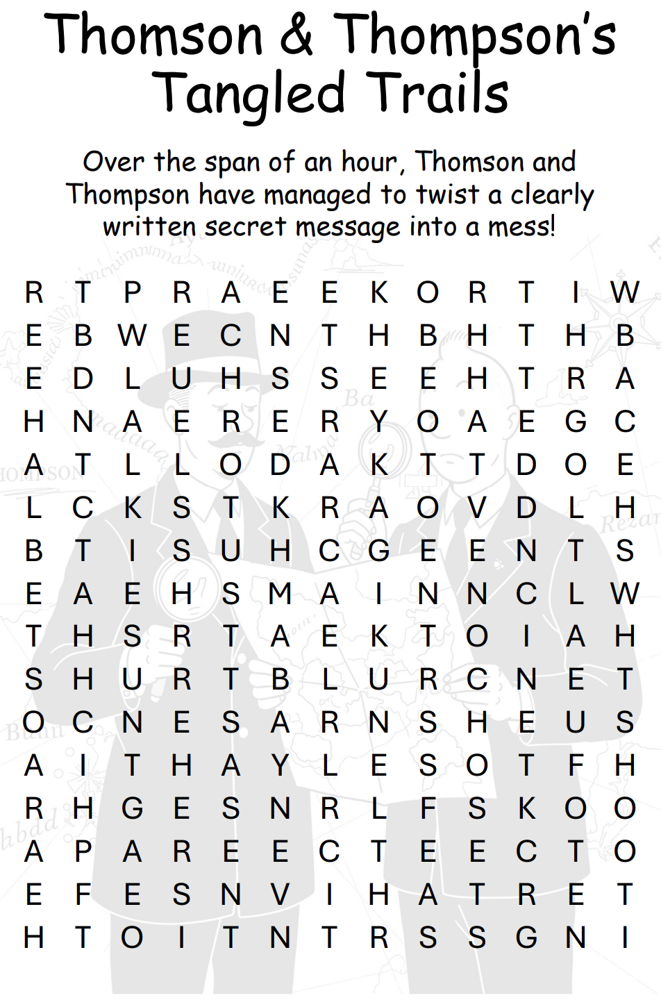
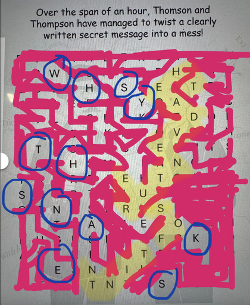

# Thomson and Thompson's Tangled Trails Puzzle Writeup

## Puzzle Info

## Solution

The first thing we noticed here were the characters Thomson and Thompson. These are from the Adventures of Tintin comic series. There didn’t seem to be any legible words in normal vertical/horizontal/forward/backwards fashion, so we figured it wouldn’t be like a regular word search.

We began by just looking at the Adventures of Tintin comics \- there is a link with all of the comic titles here: [https://www.tintin.com/en/albums\#](https://www.tintin.com/en/albums#)

The first few titles \- Soviets, Congo, and America \- were not in the puzzle, but we found the next one in the puzzle\! We took a screenshot and struck out each word path corresponding with the name of one of the Adventures of Tintin albums.

These included:

1. Cigars of the Pharaoh
2. The Blue Lotus
3. The Broken Ear
4. The Black Island
5. King Ottokar’s Sceptre
6. The Crab with the Golden Claws
7. The Shooting Star
8. The Secret of The Unicorn
9. Red Rackham’s Treasure
10. The Seven Crystal Balls
11. Prisoners of the Sun
12. Land of Black Gold

There may have been more but I think this is close to all of them.

We had some extra space at the end that didn’t correlate to a title, but saw we could connect the phrase "The Adventures of Tintin" as well.

Picture below of solving the puzzle:

Notice we missed an e and had an extra s in the puzzle. Luckily, we were able to look at "WhsyThSnakes" and determine the right answer.

This left us 12 characters, which we unscrambled to be \<result\>WhyTheSnakes\<result\>
